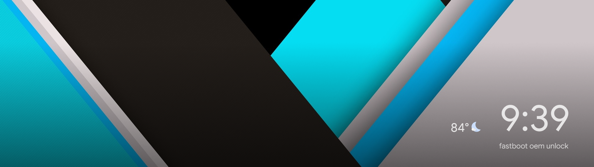
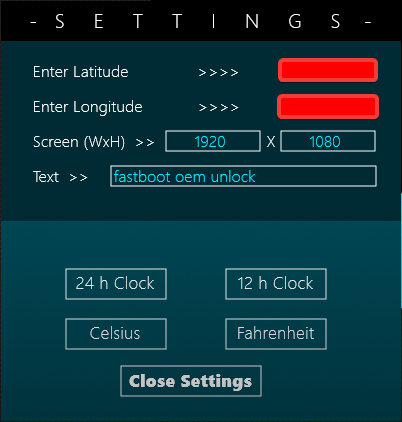
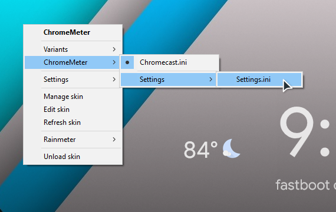

# ChromeMeter
A Chromecast-inspired skin for Rainmeter, optimized for 1080p and 1440p displays.

## Full Screenshot (wallpaper not included): 

## User-customizable settings:

## Installation:
* Clone the repo
* Paste the contents into C:\Users\\$whoami\Documents\Rainmeter\Skins\
* Go to settings:
  * 
* Find your latitude & longitude (you can use Google Maps) and paste them in the appropriate boxes
  * Make sure you press 'Enter' to apply!
* Enter your screen's dimensions, again make sure to press 'Enter!' 

## Credit:
* [Inspiration](https://www.reddit.com/r/Rainmeter/comments/ayxlnk/chromecast_inspired_rainmeter_skin/)
* [Clock](https://www.deviantart.com/defaultian28b/art/Lock-Clock-1-3-704911972)
* [Settings](https://visualskins.com/skin/flat-weather)
* [Weather Icons](https://www.deviantart.com/ncrystal/art/Google-Now-Weather-Icons-597652261)

## Technical Info: 

The weather is retrieved with the [OpenWeatherMap API](https://openweathermap.org/api) using my own, personal key. If you want to use your own key, you can change the 'Key' line in @Resources/Variables.inc
